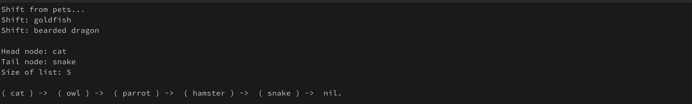

# Project: Linked Lists
Following the [TOP (The Odin Project)](https://www.theodinproject.com/lessons/ruby-linked-lists) course and developing a linked list project to practice my DSA.

## Table of Contents
- [Installation](#installation)
- [Usage](#usage)
- [Contributing](#contributing)
- [License](#license)

## Installation
1. Clone the repository:
```bash
git clone https://github.com/otherdcn/top-linked-lists.git
```

2. Install dependencies:
```bash
bundle install
```

## Usage
Build with either the singly linked list `(LinkedList::Singly)` or the doubly linked list `(LinkedList::Doubly)`
Use the following command to run the application:
```bash
ruby main.rb
```

Examples of features/abilities of Linked Lists:
1. Appending to a list with `#append`

2. Prepending to a list with `#prepend`

3. Finding nodes using `#at`, and popping/removing nodes using `#pop`

4. Shifting/ removing from top using `#shift`

5. Checking if list contains a node `#contains` and finding a node's index in list using `#find`

6. Inserting and removing nodes from random indices using `#insert_at` and `#remove_at`

7. Reverse the list using `#reverse!` (for in-place modification) and/or `#reverse` (for returning a new list).

8. Examine a node's data and its pointers using `#examine_node`
- singly linked lists

- doubly linked lists
.png)

## Contributing
If you feel the need to try it out and perhaps contribute:
1. Fork the repository.
2. Create a new branch: `git checkout -b feature-name`.
3. Make your changes.
4. Push your branch: `git push origin feature-name`.
5. Create a pull request.

## License
This project is licensed under the [MIT License](LICENSE).

